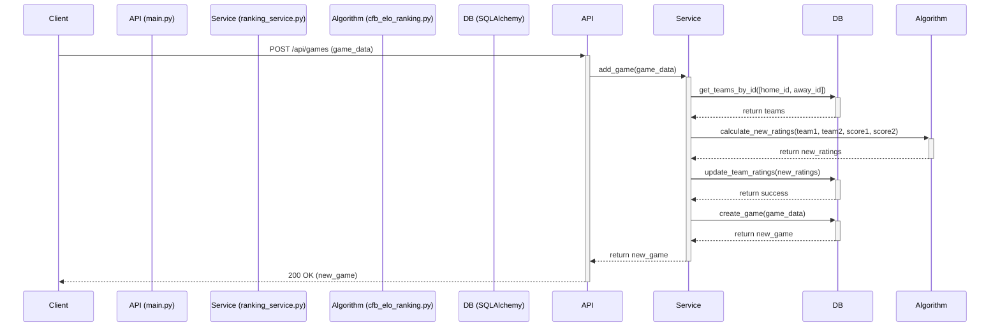

# Project Documentation

This document provides a comprehensive overview of the College Football Ranking project, including its architecture, setup, and key processes.

## 1. Introduction

This project is a college football ranking system that uses a modified ELO algorithm. It includes a REST API backend built with FastAPI, a database for storing data, and a simple frontend for displaying the rankings.

For a detailed breakdown of the system's components and their interactions, please see the [System Architecture document](docs/architecture.md).

## 2. Getting Started

### Prerequisites

- Python 3.11+
- pip

### Installation

1.  **Clone the repository:**
    ```bash
    git clone <repository-url>
    cd <repository-directory>
    ```

2.  **Install dependencies:**
    ```bash
    pip install -r requirements.txt
    ```

3.  **Configure environment variables:**
    Create a `.env` file in the project root and add the following variables:
    ```
    CFBD_API_KEY=your_api_key_here
    DATABASE_URL=sqlite:///./cfb_rankings.db
    ```
    You can obtain a free API key from [collegefootballdata.com](https://collegefootballdata.com/key).

4.  **Initialize the database:**
    To populate the database with initial data, run the following command:
    ```bash
    python3 seed_data.py
    ```

### Running the Application

To start the FastAPI server, run:
```bash
python3 main.py
```
The API will be available at `http://localhost:8000`.

## 3. Key Dependencies

The project relies on the following key Python libraries:

- **FastAPI**: A modern, fast (high-performance) web framework for building APIs.
- **Uvicorn**: An ASGI server for running the FastAPI application.
- **SQLAlchemy**: A SQL toolkit and Object-Relational Mapper (ORM) for interacting with the database.
- **Pydantic**: A data validation and settings management library.
- **Requests**: A simple HTTP library for making requests to the College Football Data API.
- **python-dotenv**: For managing environment variables.

## 4. Project Structure

The project is organized into the following key files and directories:

- `main.py`: The entry point of the FastAPI application, defining all API endpoints.
- `ranking_service.py`: The service layer containing the core business logic.
- `cfb_elo_ranking.py`: The implementation of the ELO ranking algorithm.
- `cfbd_client.py`: The client for interacting with the College Football Data API.
- `database.py`: The database setup and configuration.
- `models.py`: The SQLAlchemy ORM models.
- `schemas.py`: The Pydantic schemas for data validation.
- `frontend/`: The directory containing the HTML, CSS, and JavaScript for the user interface.
- `tests/`: The test suite for the application.
- `docs/`: The project documentation.

## 5. Sequence Diagram: Adding a New Game

The following sequence diagram illustrates the process of adding a new game to the system and updating the rankings.



This diagram shows how a single API call flows through the different layers of the application, from the API endpoint to the database, involving the core business logic and the ranking algorithm.
